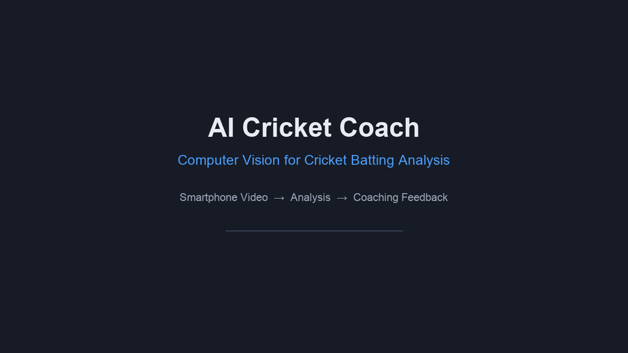
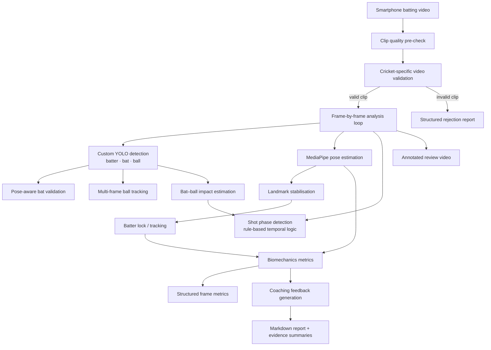

# 🏏 AI Cricket Coach


AI Cricket Coach is a computer-vision system that analyses cricket batting videos captured using ordinary smartphones and generates interpretable, evidence-based technical batting feedback.

> **Status:** Active research and engineering project.

---

## Demo



**Example:** A validated smartphone batting clip processed through the current end-to-end analysis pipeline.

The system combines player pose, cricket-object detection, temporal shot analysis and biomechanics metrics to generate interpretable batting feedback.

[View higher-quality MP4 demo](assets/ai-cricket-coach-demo.mp4)

### What the demo shows

- Player pose estimation
- Batter, bat and ball detection
- Temporal impact/event analysis
- Head Over Base analysis
- Body Lean analysis
- Shot-phase interpretation
- Generated coaching feedback

### Example analysis

The demonstrated clip passes the current cricket-video validation pipeline and contains confirmed ball evidence, an identified impact event and a valid pre-impact biomechanics analysis window.

---

## The Problem

High-quality cricket coaching can be expensive, inconsistent, or geographically inaccessible.

This project investigates whether **smartphone video + computer vision** can provide useful first-level technical batting analysis: detecting whether footage shows genuine cricket batting, estimating shot timing and body mechanics, and translating measurements into coaching observations a club player can act on.

---

## System Overview



**Design principle:** cricket batting is treated as a **temporal video problem**, not independent frame classification. Object detections, pose landmarks, and movement evidence are combined before coaching conclusions are drawn.

---

## Computer Vision Stack

Verified technologies in the private development repository:

| Layer | Technology |
|-------|------------|
| Language | Python 3.9+ |
| Video I/O & drawing | OpenCV |
| Pose estimation | MediaPipe Pose (33 body landmarks) |
| Object detection | Ultralytics YOLO11 (custom-trained cricket models) |
| Numerics & analysis | NumPy, Pandas |
| Visualisation | Matplotlib |
| Testing | pytest |
| Config | PyYAML |
| Version control | Git / GitHub |
| Dataset tooling (training experiments) | Roboflow |

**Not yet implemented in the development repository:** production FastAPI service, web UI, cloud deployment, GPU-serving layer, or learned temporal models (TCN/transformer) for phase detection.

---

## Object Detection

Custom YOLO models have been trained and iterated for cricket-specific objects:

- **Batter** — player localisation for cropping and spatial context
- **Cricket bat** — thin, fast-moving, frequently occluded
- **Cricket ball** — very small, motion-blurred, low recall at phone resolution

A **hybrid detector architecture** combines separate YOLO models for batter localisation and bat/ball detection, then fuses outputs with pose context downstream.

### Why cricket CV is hard

| Challenge | Effect |
|-----------|--------|
| Small fast ball | Low pixel footprint; easy to miss or confuse with background |
| Thin bat geometry | Bounding-box centre ≠ handle position |
| Motion blur | Reduces detector confidence during the swing |
| Occlusion | Hands, body, and nets hide bat/ball |
| Scale variation | Phone distance changes object size dramatically |
| Background clutter | Poles, railings, sticks resemble bats |
| Casual phone framing | Portrait video, cropped feet, shaky camera |

The system goes beyond raw YOLO confidence by applying **pose-aware contextual validation** and **multi-frame temporal evidence**.

---

## Pose Estimation

MediaPipe body landmarks provide the geometric foundation for:

- Full-body visibility checks
- Camera-angle-aware pose plausibility
- Wrist location for bat–player association
- Front-on biomechanics (head position, lean, tilt, stance)
- Side-on analysis scripts (head stability, stride)

Pose is also used as **contextual evidence** when validating whether a detected elongated object is genuinely associated with the batter.

---

## Temporal Shot Analysis

Video is analysed as a sequence, not isolated frames.

### Legacy five-phase model (rule-based)

When object detection is enabled, a rule-based phase detector tracks:

1. **Stance**
2. **Backlift**
3. **Downswing**
4. **Impact**
5. **Follow-through**

Phase transitions use bat/wrist vertical motion relative to a locked impact frame.

### Optional three-phase model (rule-based FSM)

An alternative finite-state machine classifies:

- **BUILDUP**
- **EXECUTION**
- **FOLLOW_THROUGH**

based on a movement score derived from pose and detection signals.

### Impact detection

A contact-zone state machine identifies when the tracked ball enters and exits an expanded bat region, then selects the frame with minimum bat–ball distance inside that window.

> **Note:** Phase and impact logic are currently **rule-based**. Trained temporal neural networks are future research, not current production behaviour.

---

## Biomechanics Metrics

Metrics convert pose and timing evidence into interpretable coaching observations.

### Front-on (in-pipeline)

| Metric | Purpose |
|--------|---------|
| **Head Over Base** | Whether the head stays over the support base through the shot |
| **Stance Width Ratio** | Foot spacing relative to shoulder width at setup |
| **Shoulder Tilt** | Lateral shoulder alignment |
| **Hip Tilt** | Pelvic level and rotation proxy |
| **Body Lean** | Torso angle relative to vertical |
| **Balance Score** | Composite stability score from head, lean, and tilt signals |

### Side-on (dedicated analysis scripts)

| Metric | Purpose |
|--------|---------|
| **Head Stability** | Lateral head drift across the clip |
| **Front-foot Stride** | Front-ankle travel from setup position |

Some additional metric modules exist as **stubs or roadmap placeholders** (e.g. bat angle, elbow angle, knee bend) and are not yet part of the coaching output.

Scoring formulas and calibration thresholds remain private.

---

## Engineering Challenges

These are representative problems investigated during development — the kind of work that goes beyond calling a detector API.

### A — False-positive bat detections

**Problem:** Net poles, railings, rods, and background clutter can look bat-like to YOLO.

**Approach investigated:** Pose-aware bat validation using wrist proximity, player-relative spatial regions, bounding-box geometry, confidence weighting, and temporal consistency — not confidence alone.

**Status:** Materially improved on difficult nets footage; false positives remain an active validation topic.

### B — Wrist / bat geometry

**Problem:** Using the **centre** of a long thin bat box mis-estimates handle proximity to the wrists.

**Approach investigated:** Nearest-point geometry on the bat bounding box, torso-normalised distance gates, and frame-level diagnostic audits.

**Status:** Implemented and evaluated; side-on and extreme swing angles remain challenging.

### C — Pose instability

**Problem:** Wrist landmark dropout, low visibility, torso-scale collapse, and frame-to-frame jitter break spatial gates.

**Approach investigated:** Landmark stabilisation, batter lock tracking, torso-scale sanity checks, and conservative rejection when wrist evidence is unavailable.

**Status:** Partial — improved robustness, ongoing edge cases documented.

### D — False rejection of valid cricket videos

**Problem:** Strict single-metric gates (e.g. full-body pose percentage) rejected genuine cricket clips that had strong multi-signal evidence elsewhere.

**Approach investigated:** Evidence-based recovery logic combining batter presence, bat evidence strength, movement, geometry plausibility, and framing safety checks.

**Status:** Implemented for borderline cases; calibration and regression testing continue.

See [`docs/engineering-challenges.md`](docs/engineering-challenges.md) for case-study detail.

---

## Failure-Mode Engineering

The project intentionally tests difficult negative and borderline cases rather than evaluating only successful clips.

Examples include:

- background structures mistaken for cricket bats
- incomplete wrist landmarks
- unstable pose scale
- valid cricket clips rejected by strict framing gates
- raw object detections rejected by pose-aware contextual validation

See [`docs/engineering-challenges.md`](docs/engineering-challenges.md).

---

## Validation

The private development repository includes a substantial automated test suite and forensic audit workflow:

| Area | Approach |
|------|----------|
| **Unit & integration tests** | pytest coverage across validators, detectors, metrics, and pipeline components |
| **Known-valid clips** | Regression batches of genuine cricket batting footage |
| **Known-invalid clips** | Gym, walking, baseball-swing, and other non-cricket negatives |
| **Frame-level diagnostics** | Bat-candidate forensics, rejection-reason counts, contact sheets |
| **False-positive analysis** | Targeted negative audits (e.g. bat-like objects without cricket context) |
| **False-negative analysis** | Borderline framing and full-body threshold sensitivity studies |

The current codebase includes **182 passing automated tests (August 2026)** covering major validation, geometry, temporal-analysis and regression behaviour.

Exact pass/fail rates on video batches vary by calibration branch and continue to be iterated — portfolio materials describe methodology, not fixed production accuracy claims.

See [`docs/validation.md`](docs/validation.md).

---

## Example Output

Below is an **illustrative output format** — not experimental results from a specific clip.

```text
Batting Analysis (Illustrative)

Head Over Base:        PASS
Stance Width:          Within expected range
Shoulder Tilt:         Slight open — monitor at setup
Body Lean:             Stable through downswing
Balance Score:         Good

Primary Observation:
  Your head moved outside your support base before impact.

Why it matters:
  Early head movement can reduce control and consistent contact.

Suggested Drill:
  Shadow batting with a focus on keeping head still until after contact.
```

A walkthrough example is in [`examples/example-analysis.md`](examples/example-analysis.md).

---

## Current Limitations

Transparent constraints as of active development:

- **Ball detection** remains difficult in low-quality or high-speed phone footage
- **Camera angle** determines which metrics are available (front-on vs side-on)
- **Player visibility** — cropped or distant subjects reduce reliability
- **Motion blur** lowers object-detection confidence during fast swings
- **Occlusion** affects both pose landmarks and bat/ball association
- **Temporal logic** is largely rule-based, not learned end-to-end
- **Ball trajectory reconstruction** is future work
- **No production API or mobile app** — CLI research pipeline today
- **Validation is ongoing** — thresholds and recovery rules continue to be calibrated

---

## Roadmap

### Current capabilities

- Smartphone video ingestion and annotated output generation
- Clip-quality and cricket-specific validation gates
- Custom YOLO batter / bat / ball detection (hybrid architecture)
- Pose-aware bat validation and multi-frame ball tracking
- Rule-based impact and phase detection
- Front-on biomechanics metrics and templated coaching feedback
- Side-on stride and head-stability analysis scripts
- Automated regression testing and forensic audit tooling

### Research / future work

See [`docs/roadmap.md`](docs/roadmap.md) for detail. Highlights:

- Improved small-ball detection and tracking
- Multi-object tracking (e.g. ByteTrack-class approaches — **not yet implemented**)
- Ball trajectory and shot-path estimation
- More reliable bat–ball impact localisation across venues
- Automatic camera-angle classification
- Shot type classification
- Learned temporal models (PyTorch TCN / action recognition)
- ONNX export and GPU inference optimisation
- Mobile/on-device inference
- Vision-language models for multimodal coaching explanations
- FastAPI service layer for structured analysis APIs

---

## Repository Access

This repository is a **technical portfolio** demonstrating the architecture, computer-vision research, and validation methodology of AI Cricket Coach.

The primary development repository, model weights, training data, and production implementation remain **private** while the project is under active development.

A technical walkthrough or private code review can be provided during appropriate research, collaboration, or recruitment discussions.

---

## Documentation Index

| Document | Contents |
|----------|----------|
| [`docs/architecture.md`](docs/architecture.md) | Module-level architecture and data flow |
| [`docs/computer-vision-pipeline.md`](docs/computer-vision-pipeline.md) | CV problem framing and design decisions |
| [`docs/engineering-challenges.md`](docs/engineering-challenges.md) | Investigation case studies |
| [`docs/validation.md`](docs/validation.md) | Testing and audit philosophy |
| [`docs/roadmap.md`](docs/roadmap.md) | Near-, medium-, and long-term direction |
| [`examples/example-analysis.md`](examples/example-analysis.md) | End-to-end analysis walkthrough |
| [`assets/README.md`](assets/README.md) | Portfolio visuals and optional enhancements |
| [`LICENSE-NOTICE.md`](LICENSE-NOTICE.md) | IP and usage notice |
