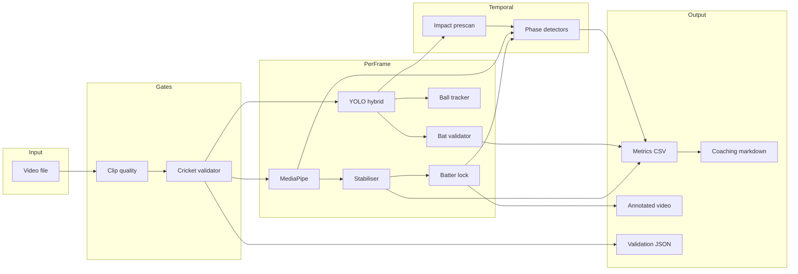

# Architecture

> High-level architecture of AI Cricket Coach. This document describes **design and data flow** only — not proprietary source code, thresholds, or model weights.

---

## Design goals

1. **Reject bad input early** — non-cricket footage, unusable phone video, or clips without batting evidence should fail fast with explainable reasons.
2. **Fuse multiple evidence types** — YOLO detections alone are insufficient; pose, movement, and temporal consistency matter.
3. **Keep analysis interpretable** — metrics and coaching outputs should map to cricket concepts coaches and players understand.
4. **Support forensic debugging** — frame-level diagnostics and structured validation JSON for regression work.

---

## Pipeline stages

### 1. Video input

- Input: smartphone `.mp4` / `.mov` batting clips
- OpenCV reads frames; FPS and resolution drive downstream sampling windows

### 2. Clip quality pre-check

**Purpose:** Fast, lightweight rejection of obviously unusable footage before expensive analysis.

**Signals investigated:**
- Brightness / exposure
- Camera shake
- Subject size in frame
- Presence of a batter-like figure
- Basic batting motion cues
- Bat-detection rate (when YOLO enabled)

**Outcomes:** pass, pass with warning, or hard fail with user-facing guidance.

### 3. Cricket-specific video validation

**Purpose:** Confirm the clip shows **cricket batting context**, not merely a person moving.

**Evidence combined:**
- Full-body pose visibility (MediaPipe)
- Camera-angle-aware pose geometry plausibility
- Accepted bat detections associated with the player
- Batter detection rate
- Confirmed moving ball track (when visible)
- Body movement score
- Framing / subject scale classification

**Outcomes:** valid, valid with warnings, or structured rejection (e.g. no bat evidence, invalid geometry, extreme framing).

**Recovery logic (implemented):** For borderline full-body framing, multi-signal evidence can recover otherwise valid cricket clips — subject to independent safety gates.

### 4. Batter detection and batter lock

**YOLO batter model** proposes batter bounding boxes in hybrid mode.

**Batter lock** tracks shoulder/hip centroid across frames to maintain identity in busy nets footage and reject large implausible jumps.

**Pose-derived batter region** can supplement YOLO when boxes are missing, enabling spatial validation to proceed.

### 5. Pose extraction

MediaPipe Pose extracts 33 landmarks per frame.

Landmarks feed:
- Full-body and geometry validators
- Wrist locations for bat association
- Biomechanics metrics
- Movement scores for phase detection

### 6. Landmark stabilisation

Raw landmarks jitter frame-to-frame. A stabiliser smooths selected landmarks (e.g. wrists) while preserving real motion where possible.

### 7. Bat and ball detection

**Hybrid architecture:**
- One YOLO model focused on **batter** localisation
- One YOLO model for **bat** and **ball**

Raw detections are preserved for validation — the validator does not silently discard low-confidence candidates before forensic review.

### 8. Pose-aware detection validation

#### Bat validation

Each bat candidate is evaluated against:
- Expanded batter spatial region
- Wrist proximity using geometry beyond box-centre distance
- Torso-normalised distance scaling
- Composite validation score
- Conservative behaviour when wrist evidence is unavailable

#### Ball validation

Multi-frame tracker with states (unconfirmed → tentative → confirmed → lost).

Rejects static edge false positives using motion, corridor, trajectory, and cluster heuristics.

Only confirmed tracks feed impact detection by default.

### 9. Temporal phase detection

Two rule-based systems coexist:

| System | Phases | Basis |
|--------|--------|-------|
| Legacy five-phase | stance, backlift, downswing, impact, follow-through | Bat/wrist vertical motion vs locked impact |
| Optional three-phase FSM | BUILDUP, EXECUTION, FOLLOW_THROUGH | Movement score state machine |

### 10. Impact estimation

Prescan pass locks a single impact frame per clip using a contact-zone state machine around the validated bat box and tracked ball.

Peak frame selection uses minimum bat–ball distance within the contact window, with direction-change tie-breakers.

### 11. Biomechanics metrics

Front-on metrics computed in the main loop; side-on metrics via dedicated post-processing scripts.

Outputs land in structured CSV alongside per-frame detection and phase columns.

### 12. Coaching feedback generation

Rule-based narrative layer prioritises 1–3 observations tied to metric evidence.

Generates markdown coaching report and optional evidence summaries.

---

## Data flow diagram

---

## Major module groups (private repository)

| Group | Responsibility |
|-------|----------------|
| `analysis/` | Validators, coaching feedback, clip quality, evidence generation |
| `detectors/` | YOLO wrappers, hybrid detector, ball tracker |
| `metrics/` | Biomechanics computations |
| `phases/` | Optional three-phase FSM |
| `shot_logic/` | Legacy phases and impact detection |
| `selection/` | Batter lock and striker selection |
| `shared/` | Video I/O, drawing, CSV utilities |
| `scripts/` | CLI entry points (orchestration lives here today) |

The main orchestrator is currently a **CLI script** rather than a microservice — deliberate for rapid iteration during research.

---

## What this architecture deliberately avoids (today)

- End-to-end deep learning for coaching language
- Cloud deployment and autoscaling
- Real-time streaming inference
- Multi-camera 3D reconstruction
- Personalised player models

These are documented as future research directions in [`roadmap.md`](roadmap.md).

---

## Related documents

- [`computer-vision-pipeline.md`](computer-vision-pipeline.md) — CV problem depth
- [`engineering-challenges.md`](engineering-challenges.md) — failure investigations
- [`validation.md`](validation.md) — test methodology
