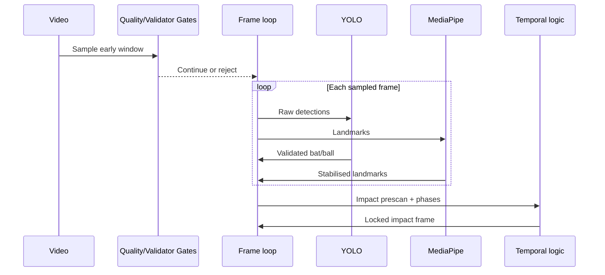

# Computer Vision Pipeline

> Why cricket batting video is a difficult computer-vision domain — and how AI Cricket Coach approaches it.

---

## Problem framing

Cricket batting analysis from phone video requires solving several coupled CV problems simultaneously:

1. **Is this even cricket batting footage?**
2. **Where is the player, bat, and ball?**
3. **Is the detected bat actually connected to this player?**
4. **When does contact occur?**
5. **What did the body do before, during, and after contact?**
6. **Can those measurements be explained to a coach or player?**

Each step fails differently. A portfolio-grade system must show awareness of **failure modes**, not only happy-path demos.

---

## Cricket-specific object detection

### Batter

Goal: localise the striker for cropping, spatial context, and scale normalisation.

Challenges:
- Multiple people in nets lanes
- Partial occlusion by nets or other players
- Variable scale (phone distance)

Approach: custom YOLO batter detector + temporal batter lock using pose centroids.

### Cricket bat

Goal: detect and associate the bat with the batter across the swing arc.

Challenges:
- Thin elongated object — bounding-box centre ≠ handle
- Motion blur during downswing
- Background objects (poles, sticks, net posts) resemble bats
- Bat leaves the expanded player region during follow-through

Approach:
- Custom YOLO bat class
- **Design B pipeline:** preserve all raw candidates → pose-aware validator → at most one accepted bat per frame
- Wrist proximity using nearest bbox geometry and torso-normalised distances

### Cricket ball

Goal: detect and track the ball well enough to support impact timing.

Challenges:
- Extremely small at phone resolution
- Short visibility window
- Confusion with white net knots, glare, and compression artifacts

Approach:
- Lower confidence threshold than bat (class-specific)
- Multi-frame ball tracker with confirmed-track gating
- Motion and edge-static rejection heuristics

---

## Small-object detection

The ball is the canonical **small fast object** problem in this project.

Current status:
- Detection exists and supports impact logic on favourable clips
- Recall is inconsistent across lighting, shutter speed, and distance
- Trajectory reconstruction is **not** production-ready

This is explicitly flagged as near-term research, not a solved capability.

---

## Pose estimation role

MediaPipe provides 33 landmarks. In this project pose is not decorative — it is **evidential**:

| Use | Why it matters |
|-----|----------------|
| Full-body gate | Reject close-ups unsuitable for biomechanics |
| Geometry plausibility | Front-on vs side-on structure checks |
| Wrist location | Bat–player association |
| Biomechanics | Head over base, lean, tilt, stance |
| Movement score | Phase FSM input |

### Pose failure modes

- Wrist visibility dropout when hands blur
- Ankle visibility loss in portrait phone framing
- Threshold-edge classification flipping pass/fail on near-gate frames (documented reproducibility issue)
- Torso scale collapse causing bad normalisation

Mitigations investigated: stabilisation, torso-scale sanity, conservative rejection without wrist evidence.

---

## Camera angle

Metrics are **angle-dependent**:

| Angle | Metrics available |
|-------|-------------------|
| Front-on | Head over base, stance width, shoulder/hip tilt, body lean, balance |
| Side-on | Head stability (lateral), front-foot stride |

The system classifies angle candidates from pose geometry. Mixed or oblique angles reduce metric reliability — coaching output should reflect that uncertainty.

---

## Object–pose fusion

The core engineering insight: **YOLO and pose must agree contextually**.

Example failure: YOLO fires on a net pole (high confidence) while wrists are far away → reject.

Example nuance: YOLO misses a baseball bat class on some frames but detects low-confidence cricket-bat-shaped responses on others → validation sampling window matters.

Fusion signals used (conceptually):
- Spatial — inside expanded batter region
- Proximity — nearest bat-point to wrists, torso-normalised
- Temporal — accepted bat runs, movement, ball track continuity
- Plausibility — pose geometry and framing

Exact weighting and thresholds are proprietary.

---

## Video frame processing model

Validation gates intentionally sample an **early window** of the clip (duration- and FPS-aware). This design choice improves latency but creates a documented blind spot when batting action starts late in the file — an active validation research topic.

---

## Temporal evidence

Single-frame correctness is insufficient.

Examples of temporal reasoning implemented or investigated:
- Ball track state machine (confirmed motion)
- Accepted bat frame runs and percentages
- Impact window state machine
- Phase transitions conditioned on locked impact
- Movement score smoothing for FSM phases

Learned temporal models (TCN, transformers) are **roadmap only**.

---

## Output artefacts (private pipeline)

| Artefact | Purpose |
|----------|---------|
| Annotated MP4 | Visual review of pose, boxes, phases |
| CSV | Per-frame metrics and detection columns |
| Coaching markdown | Player-facing feedback |
| Validation JSON | Structured pass/fail diagnostics |
| Audit reports | Engineering forensics (not player-facing) |

---

## Comparison to a "YOLO tutorial" project

| Tutorial project | AI Cricket Coach |
|------------------|------------------|
| Single detector threshold | Multi-stage gates + recovery logic |
| Box drawn = success | Pose-aware association validation |
| No invalid-video testing | Known-negative audit sets |
| Static images | Temporal impact and phase logic |
| Generic COCO classes | Cricket-specific training iterations |
| No coaching domain | Biomechanics → language pipeline |

---

## Related documents

- [`architecture.md`](architecture.md)
- [`engineering-challenges.md`](engineering-challenges.md)
- [`validation.md`](validation.md)
